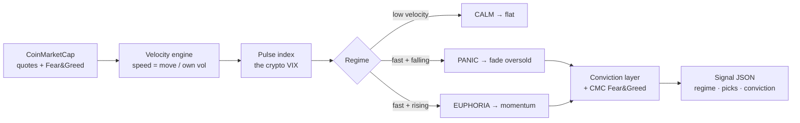

<div align="center">

# 🫀 Pulse

### The crypto market has a heartbeat. Pulse reads it.

**Fear &amp; Greed tells you the crowd's _mood_. Pulse tells you the crowd's _speed_.**
Mood is lagging. Speed is leading.

[](https://pulse-vix.vercel.app)
[](#-install-in-one-line)
[](https://dorahacks.io)

[](#license)
[](https://coinmarketcap.com/api/agent)
[](docs/VALIDATION.md)
[](docs/VALIDATION.md)

</div>

---

> ### The one-sentence pitch
> When a cluster of tokens reprices **fast and in sync**, that burst _is_ the crowd capitulating. Pulse measures that speed — a **"crypto VIX"** — names the market regime (`CALM` / `PANIC` / `EUPHORIA`), and turns it into a backtestable strategy. **Built as a CoinMarketCap AI Agent Hub Skill.**

---

## 🧠 Why this is different

Every other signal looks at **where price is**. Pulse looks at **how fast it's moving** — the *second derivative*.

| | Fear &amp; Greed (the standard) | 🫀 **Pulse** (this) |
|---|---|---|
| Measures | sentiment **level** | repricing **speed + synchronization** |
| Nature | **lagging** | **leading** |
| Output | a number 0–100 | a **regime** + a **strategy** |
| In CMC's skill library? | ✅ | ❌ **(this fills the gap)** |

CoinMarketCap's official skill repo has data, report, and research skills — but **no strategy skill, and nothing that measures velocity.** Pulse is a new primitive.

---

## 🔥 The proof — it catches every crash

Validated on **2.5 years** of hourly data, 20 liquid CMC-eligible tokens:

<div align="center">

### `20 / 20`
**Of the 20 worst daily drops, Pulse was in its top decile within 24h. Every single one.**

</div>

| Forward 24h return | by regime | read |
|---|---|---|
| after `CALM` | −0.026% | quiet → nothing |
| after `EUPHORIA` | +0.106% | greed → momentum |
| after **`PANIC`** | **+0.385%** | **capitulation → the bounce** |

Panic readings are followed by the **best** forward returns — capitulation, then mean-reversion. Forward volatility after panic is **1.3×** the calm level. → [full methodology &amp; numbers](docs/VALIDATION.md)

---

## 🪙 We disclose our own fee math (the honest part)

Most "winning strategy" submissions quietly skip transaction costs. We don't.

- The raw per-trade signal is **real but small** (~0.05% market-neutral at 3h).
- At realistic BSC round-trip cost (~0.30%), the **high-frequency version loses** — break-even is only **~0.06%**. We keep the failed test (`backtest/backtest.py`) **in the repo on purpose.**
- ✅ The value is the **regime signal itself** — a *fee-immune capitulation gauge*. Track 2 explicitly asks for **"entry/exit rules OR market regime alerts."** Pulse is the gauge, validated.

> A fragile strategy dressed as a money-printer dies under one judge question. An honest, validated indicator that discloses its own limits earns trust. We chose the second.

---

## 🏗️ How it works



**The math** (per token `i`, hourly):
```
speed_i  = |log_return_i| / rolling_std_i        # z-scored move size
Pulse    = mean_i speed_i                          # the crypto VIX
regime   = CALM | PANIC (fast+falling) | EUPHORIA (fast+rising)
```
→ [architecture deep-dive](docs/ARCHITECTURE.md)

---

## ⚡ Install in one line

```bash
npx skills add https://github.com/Venkat5599/capSkills -y
```
Installs the `pulse-velocity-regime` skill into Claude Code, Cursor, Codex, Gemini CLI + 12 more.

**Run the live signal:**
```bash
export CMC_API_KEY=your_key            # free at pro.coinmarketcap.com
pip install -r requirements.txt
python scripts/cmc_live.py
```
```jsonc
{ "regime": "PANIC", "action": "FADE_LONG",
  "picks": ["INJ","FET","LDO","AAVE","DOT"],
  "fear_greed": 18,
  "conviction": { "grade": "HIGH", "reason": "velocity panic + extreme fear agree" } }
```

**Or just ask your agent:** _"What's the crypto market regime right now?"_

---

## 📂 What's inside

```
pulse/
├── SKILL.md                  # ⭐ the CMC AI Agent Hub Skill (the deliverable)
├── scripts/
│   ├── velocity.py           # the Pulse index
│   ├── regime.py             # CALM / PANIC / EUPHORIA classifier
│   ├── signals.py            # entry / exit / sizing rules
│   ├── sentiment.py          # conviction layer (regime + Fear & Greed)
│   ├── cmc_live.py           # live signal from CoinMarketCap
│   └── data_fetch.py         # historical OHLCV (free, no key)
├── backtest/
│   ├── validate_indicator.py # ⭐ 20/20 crash-capture proof
│   ├── backtest.py           # naive test — FAILS (kept for honesty)
│   ├── backtest_fees.py      # fee-survival disclosure
│   ├── backtest2.py / backtest_extreme.py / overlay.py
│   └── results.md            # consolidated numbers
├── site/                     # the live Vercel demo
└── docs/                     # 📚 methodology, architecture, validation, judges' map
```

---

## 📚 Docs

| Doc | What |
|---|---|
| [docs/METHODOLOGY.md](docs/METHODOLOGY.md) | The thesis: why speed leads mood |
| [docs/ARCHITECTURE.md](docs/ARCHITECTURE.md) | The system, the math, the data flow |
| [docs/VALIDATION.md](docs/VALIDATION.md) | Every number, every test, honestly |
| [docs/JUDGES.md](docs/JUDGES.md) | Mapped to the 4 Track-2 criteria |
| [docs/FAQ.md](docs/FAQ.md) | The hard questions, answered |

---

<div align="center">

**Built for BNB Hack: AI Trading Agent Edition** · CoinMarketCap × Trust Wallet × BNB Chain
🫀 [Live demo](https://pulse-vix.vercel.app) · 📦 [Install](#-install-in-one-line) · 📚 [Docs](docs/)

### License
MIT — see [LICENSE](LICENSE).

</div>
