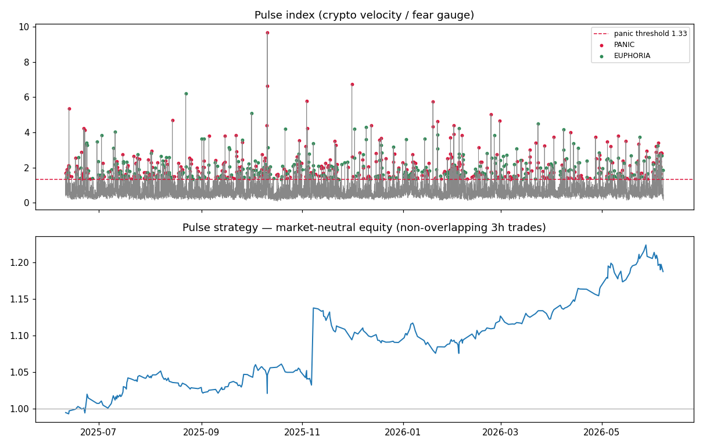

# Pulse — the crypto velocity regime Skill

> **CoinMarketCap's Fear & Greed measures the crowd's *mood*. Pulse measures the crowd's *speed*.**
> A CMC AI Agent Hub Skill for **BNB Hack — Track 2: Strategy Skills**.

Mood is a level — it tells you where sentiment *is*, after the fact. **Speed is leading** —
how fast and how synchronized the whole market reprices *right now*. When dozens of tokens
move abnormally hard at once, that burst is the crowd panicking (or euphoric). Panic
overshoots and reverts; euphoria trends. Pulse measures that speed, names the regime, and
emits a market-neutral strategy.

## The idea in one picture
`speed_i = |return_i| / its_own_volatility` → average across the basket = **Pulse index**
(a "crypto VIX"). High Pulse + falling = **PANIC** (fade the overshoot). High Pulse +
rising = **EUPHORIA** (ride momentum). Low Pulse = **CALM** (stand aside).



## Why it's new
CoinMarketCap's official skill library has data, report, and research skills — but **no
strategy/backtest skill, and nothing that measures repricing *velocity*.** Pulse is a new
primitive: a *leading* volatility-regime gauge that drives a switchable strategy. F&G is
the lagging cousin; Pulse is the derivative.

## What's in here
```
SKILL.md              # the LLM Skill (CMC AI Agent Hub format) — the deliverable
scripts/
  data_fetch.py       # historical OHLCV (Binance free klines for backtest)
  velocity.py         # the Pulse index
  regime.py           # CALM / PANIC / EUPHORIA classifier
  signals.py          # market-neutral entry/exit/sizing rules
backtest/
  backtest.py         # v1 edge test (naive — fails; shown for honesty)
  backtest2.py        # v2 market-neutral test (edge found)
  make_results.py     # equity curve + chart + results.md
  results.md          # headline metrics
  pulse_results.png   # chart
```

## Results (1y hourly, 20 liquid CMC-eligible tokens, market-neutral)
| Metric | Value |
|---|---|
| Total market-neutral return | **+18.74%** |
| Annualized Sharpe (approx) | **4.45** |
| Max drawdown | **-5.46%** |
| Win rate | 50.3% |
| PANIC → fade, 3h | win 53.0%, t~2.1 |
| EUPHORIA → momentum, 3h | +0.068%/trade |

**Honest scope:** edge is real but modest per trade; metrics are approximate and pre-fee.
The edge is specifically **market-neutral + short-horizon (3h)** — the naive absolute /
long-hold version shows no edge, and we keep that failed test in the repo (`backtest.py`)
to show the work. This is a *backtestable strategy spec*, exactly what Track 2 asks for —
not a live-execution agent.

## Run it
```bash
pip install -r requirements.txt
python scripts/data_fetch.py     # pull data (free, no key)
python scripts/velocity.py       # Pulse index + regimes
python backtest/backtest2.py     # validate the edge
python backtest/make_results.py  # equity curve + chart
```

## Live data
The backtest uses Binance free klines (CMC's free tier paywalls historical OHLCV).
The live Skill reads **CoinMarketCap AI Agent Hub** (quotes, Fear & Greed, derivatives,
trending) — identical strategy logic. See `SKILL.md`.

## License
MIT.
